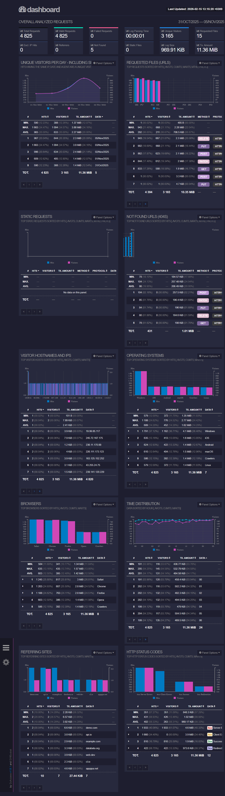

## ЧТО ЭТО

Практический проект по мониторингу и анализу логов на Linux. В рамках проекта я научилась обрабатывать логи вручную с помощью bash-скриптов и автоматизировать этот процесс с помощью готовых утилит.

За основу брались логи nignx в стандартном формате. Сами логи полностью синтетические {ಠʖಠ}

